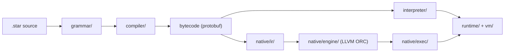

# Starlark

A high-performance [Starlark](https://github.com/bazelbuild/starlark/blob/master/spec.md) implementation in C++, built with Bazel. Starlark is a small, deterministic Python-like language used by Bazel and other build systems.

This project provides two execution backends that share the same frontend (parser, compiler, and runtime object model):

- **Interpreter** — a bytecode virtual machine for correctness, fast iteration, and reference behavior.
- **Native engine** — compiles bytecode to LLVM IR, JITs it with LLVM ORC, and executes native code with an on-disk dylib cache.

## Architecture



Both backends use the same `runtime/` object model and `vm/` module-loading infrastructure. The native path adds LLVM IR generation, JIT compilation, and a runtime shim for operations that cannot be inlined.

## Requirements

- [Bazel](https://bazel.build/) 9.2.0 (use [Bazelisk](https://github.com/bazelbuild/bazelisk); version is pinned in `.bazeliskrc`)
- A C++23-capable toolchain (the project builds with `-std=c++2b`, no exceptions, no RTTI)
- macOS is the primary development platform; other platforms may work but are less tested

## Building

```bash
# Build the command-line runners
bazel build //interpreter:interpreter_main //native/runner:native_main
```

## Running programs

The CLI runners accept a single Starlark source file. Pass an absolute path (or a path relative to your current working directory):

```bash
# Bytecode interpreter
bazel run //interpreter:interpreter_main -- $(pwd)/bench/fibonacci.star

# LLVM JIT native engine
bazel run //native/runner:native_main -- $(pwd)/bench/fibonacci.star
```

The native runner supports optional environment variables:

| Variable | Effect |
|----------|--------|
| `STARLARK_NATIVE_CACHE` | Directory for on-disk JIT dylib cache |
| `STARLARK_NATIVE_WARM_CACHE` | Populate the cache on JIT misses (implies writing dylibs) |

## Testing

The test suite is organized around Bazel targets. Spec and error tests use dedicated test runners that inject assertion helpers (`assert_eq`, `assert_true`, etc.); use `bazel test`, not the bare CLIs, for those files.

```bash
# Run a single spec test (interpreter and native)
bazel test //spec/tests:spec_interpreter_test_function.star
bazel test //spec/tests:spec_native_test_function.star

# Run all native spec tests (excludes a few very large files)
bazel test //spec:native_spec_tests

# Run all error-message tests (interpreter + native)
bazel test //errors/test:all

# Or only the native error suite
bazel test //errors/test:all_native_errors_tests

# Run unit tests for a package
bazel test //runtime:all
bazel test //grammar:all
```

Fuzz tests are available for the lexer, parser, interpreter, and native runner. They require a Homebrew LLVM toolchain and the `asan-libfuzzer` config:

```bash
bazel test --config=asan-libfuzzer //grammar:lexer_fuzz_test
bazel test --config=asan-libfuzzer //interpreter:interpreter_fuzz_test
bazel test --config=asan-libfuzzer //native/runner:native_fuzz_test
```

Address-sanitizer builds are available via `--config=asan`.

## Benchmarks

Compare interpreter vs native (cold and steady-state) execution:

```bash
bazel run //bench:benchmark -- --benchmark_min_time=1s
```

For optimized builds, add `-c opt`. See `native/runner/PERF_REGRESSIONS.md` for performance experiment notes.

## Project layout

| Directory | Purpose |
|-----------|---------|
| `grammar/` | Lexer, parser, and AST construction |
| `compiler/` | Bytecode generation and static analysis |
| `interpreter/` | Bytecode virtual machine |
| `native/` | LLVM IR generation, JIT engine, and native execution runtime |
| `runtime/` | Starlark types, builtins, and object model |
| `vm/` | Frames, module loading, and program limits |
| `proto/` | Protobuf schemas for AST and bytecode |
| `spec/` | Language conformance tests |
| `errors/` | Error message and diagnostic tests |
| `unicode/` | Unicode data tables and UTF-8 handling |
| `bigint/` | Arbitrary-precision integer arithmetic |
| `bench/` | Google Benchmark harness |
| `bzl/` | Bazel macros (`program_test`, etc.) |

## Language options

Grammar and runtime behavior can be tuned via `grammar_options` and `runtime_options` (see `grammar/options.hpp` and `runtime/options.hpp`). These control dialect features such as load-statement ordering, top-level control flow, recursion limits, and maximum collection sizes.

## License

Copyright 2024–2026 Lucas Mirelmann
